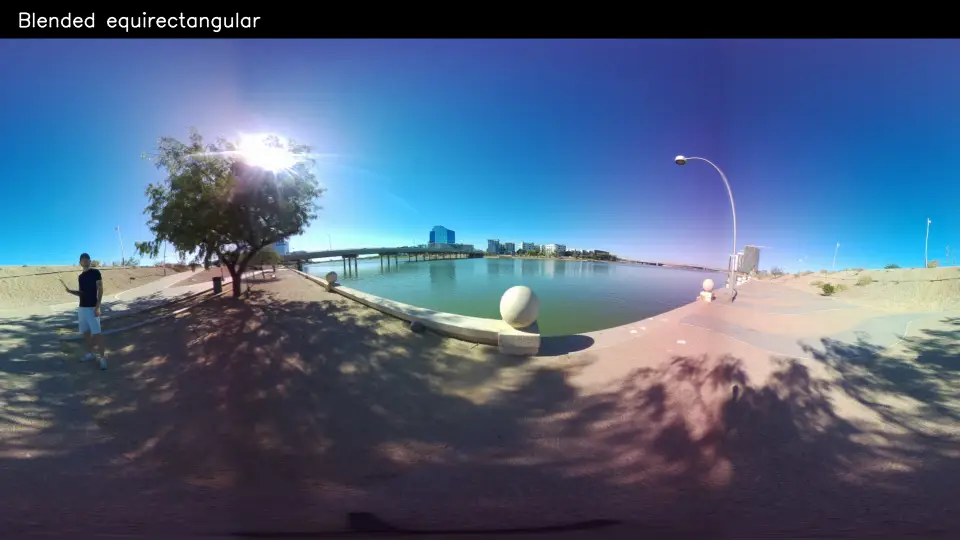
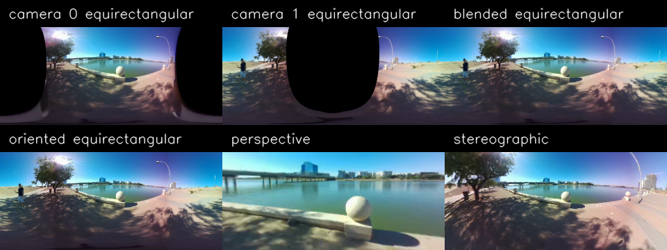
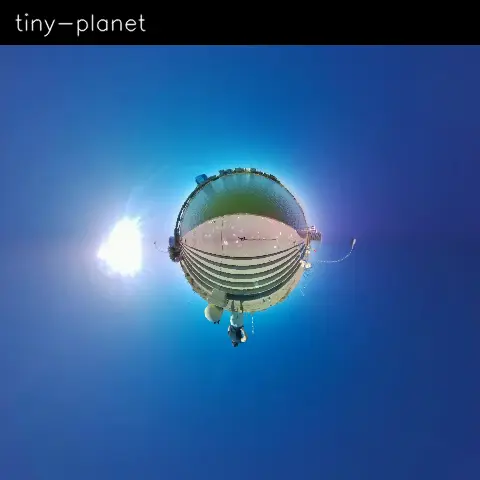
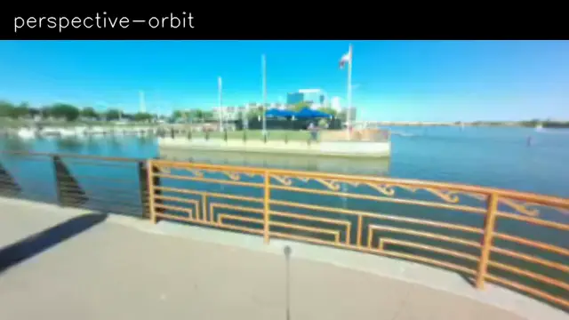

# RPI360

Dual-fisheye calibration, recording, stitching, and controllable 360-degree
playback for Raspberry Pi 5.



RPI360 records two original fisheye H.264 tracks and the exact calibration that
was active at capture time into one MP4. The same `Player` API then provides
raw cameras, per-camera equirectangular maps, a blended panorama, perspective
views, stereographic views, and tiny-planet effects.

This repository contains three small calibrated recordings, so desktop playback
works immediately without Raspberry Pi hardware.

## Try it in five minutes on macOS or Linux

Install Python 3.9+, OpenCV, and ffmpeg:

```bash
git clone https://github.com/Henry-Chi-0221/rpi360.git
cd rpi360
python3 -m venv .venv
source .venv/bin/activate
python -m pip install --upgrade pip
python -m pip install -e ".[desktop]"
ffmpeg -version
```

Open the included recording:

```bash
rpi360 play assets/samples/lake.r360.mp4
```

or run the API example directly:

```bash
python examples/playback/viewer.py assets/samples/lake.r360.mp4
```

Controls:

| Key | Action |
| --- | --- |
| `W/A/S/D` | pitch/yaw |
| `Z/X` | roll |
| `+/-` | FOV |
| `1/2/3` | perspective / stereographic / oriented equirectangular |
| `4` | fixed blended equirectangular panorama |
| `5/6` | camera 0 / camera 1 equirectangular maps |
| `7/8` | raw camera 0 / camera 1 |
| `Space` | pause |
| `J/L`, `,/.`, `0` | seek / step / restart for MP4 |
| `[/]` | playback speed |
| `R` | reset view |
| `Q` or `Esc` | quit |

You can also select a display at startup:

```bash
rpi360 play assets/samples/lake.r360.mp4 --display equi_blended
rpi360 play assets/samples/lake.r360.mp4 --display perspective --fov 100
rpi360 play assets/samples/lake.r360.mp4 --display stereographic --fov 300
```



## Hardware

The validated camera uses:

- Raspberry Pi 5, 8 GB RAM.
- 2 x [Arducam B0287 Sony IMX219 wide-angle camera modules](https://www.arducam.com/arducam-imx219-wide-angle-camera-module-for-nvidia-jetson-raspberry-pi-compute-module-4-3-3-b0287.html).
- A rigid custom 3D-printed back-to-back camera frame.
- Active cooling, microSD storage, and two Pi 5-compatible camera cables.
- A reliable 5 V / 5 A supply; the
  [official 27 W supply](https://www.raspberrypi.com/documentation/computers/raspberry-pi.html#power-supply)
  is the safe reference.

The original field rig also carries a phone power bank. Do not assume every
power bank can sustain a Pi 5 plus two cameras. Before and after calibration or
recording, verify:

```bash
vcgencmd get_throttled
```

Use a local display or graphical desktop for the interactive OpenCV calibration
windows. Plain SSH without display forwarding cannot show them.

See [the complete hardware and mounting guide](hardware/README.md). The custom
CAD folder is reserved but intentionally empty until the original model files
are published.

## Raspberry Pi setup

Use current 64-bit
[Raspberry Pi OS](https://www.raspberrypi.com/documentation/computers/os.html).
[Picamera2](https://www.raspberrypi.com/documentation/computers/camera_software.html)
and OpenCV should come from `apt`, not a second pip installation:

```bash
sudo apt update
sudo apt install -y python3-full python3-venv python3-picamera2 python3-opencv ffmpeg

git clone https://github.com/Henry-Chi-0221/rpi360.git
cd rpi360
python3 -m venv --system-site-packages .venv
source .venv/bin/activate
python -m pip install --upgrade pip
python -m pip install -e .
```

`--system-site-packages` is required so the virtual environment can import the
Raspberry Pi OS builds of Picamera2, libcamera, NumPy, and OpenCV. It also avoids
the PEP 668 `externally-managed-environment` error.

Confirm both sensors before doing any calibration:

```bash
rpicam-hello --list-cameras
python -c "from picamera2 import Picamera2; import cv2; print(cv2.__version__)"
rpi360 --help
```

## Calibration comes first

Every physical rig needs its own calibration. The included
[`rpi5-dual-imx219-example.json`](calibration/rpi5-dual-imx219-example.json)
contains this project's exact 1640 x 1232, FOV 210, K/D/R result, but it is only
valid while that particular printed rig remains mechanically unchanged.

### Stage 1: both camera intrinsics

Print
[`hardware/calibration/checkerboard-9x6-a4.pdf`](hardware/calibration/checkerboard-9x6-a4.pdf)
at **100% / Actual Size**. Disable page fitting and verify the 100 mm reference
line.

Run:

```bash
rpi360 calibrate-cameras calibration-result.json
```

The UI calibrates camera 0 and camera 1 in sequence. Move the board across the
whole fisheye circle and vary its distance and tilt. Hold it still until a
sample is accepted, then move to a new pose. The result is written directly to
`calibration-result.json`.

Re-running stage 1 updates the same file and invalidates its older rig rotation.
This is intentional: K/D and rig rotation must never come from different
calibration runs.

### Stage 2: camera-to-camera rotation

Place the assembled rig on a tripod in a stable, textured environment visible
to both lenses. Avoid mostly blank walls, moving crowds, or holding the rig.

```bash
rpi360 calibrate-rig calibration-result.json
```

The default high-accuracy workflow:

1. records both cameras for 30 seconds;
2. closes both cameras and both encoders completely;
3. reviews 20 stable samples;
4. remaps both fisheyes to equirectangular space;
5. runs SIFT, mutual matching, spherical RANSAC, and Kabsch/SVD;
6. updates the same `calibration-result.json`.

The command prints its timestamped work directory. If processing is interrupted,
reuse the captured videos:

```bash
rpi360 calibrate-rig calibration-result.json \
  --resume \
  --work-dir rig-calibration-work/20260729-120000
```

Use `--quality balanced` only when faster iteration matters more than the final
reference-quality result. See [calibration principles](docs/calibration.md) for
the acceptance tests and rotation definition.

## Live controllable preview

Live capture reads calibration from the JSON file:

```bash
rpi360 live calibration-result.json
```

The same stage and projection choices used by MP4 playback are available:

```bash
rpi360 live calibration-result.json --display perspective
python examples/rpi/live_viewer.py calibration-result.json
```

Pausing the viewer does not pause the cameras. Resume immediately shows the
latest complete frame pair instead of an old queue.

## Record an RPI360 MP4

```bash
rpi360 record calibration-result.json capture.r360.mp4 --duration 60
```

Recording uses Picamera2 only. There is no OpenCV camera fallback. The output is
atomically finalized with:

- camera 0 H.264 as track ID 1;
- camera 1 H.264 as track ID 2;
- compact `rpi360` metadata;
- the complete `rpi360_calibration_result` JSON and diagnostics.

Preview performance does not change the raw recording path. Inspect the result:

```bash
rpi360 inspect capture.r360.mp4
rpi360 play capture.r360.mp4
```

`Player.mp4()` always uses the calibration embedded in the MP4. It does not
accept an external calibration JSON.

## Minimal Player API

```python
from rpi360 import Player

with Player.mp4("assets/samples/lake.r360.mp4") as player:
    frame = player.next(timeout=None)
    if frame is not None:
        raw_0 = frame.output("camera0")
        raw_1 = frame.output("camera1")
        equi_1 = frame.output("equi_1")
        equi_2 = frame.output("equi_2")
        blended = frame.output("equi_blended")
        selected_view = frame.output("view")

        player.configure("perspective", size=(1280, 720), fov=100)
        player.set_orientation(yaw=45, pitch=-10, roll=0)
```

For a service or another UI toolkit:

```python
from rpi360 import Player

with Player.mp4("capture.r360.mp4", paced=False) as player:
    while True:
        frame = player.next(timeout=None)
        if frame is None:
            break
        publish(frame.image)
        inspect(frame.equi_blended)
```

All arrays are independent, read-only `uint8` BGR snapshots. Pass frames to
worker threads or service queues; keep the `Player` itself on one consumer
thread.

See [the API guide](docs/api.md) and
[`examples/playback/process_frames.py`](examples/playback/process_frames.py).

## Effects

Tiny planet uses a stereographic projection, FOV 300 degrees, absolute pitch
-90 degrees, and a deterministic roll sweep:



```bash
python examples/playback/effects.py \
  assets/samples/steps.r360.mp4 \
  --effect tiny-planet
```

Other presets:

```bash
python examples/playback/effects.py assets/samples/steps.r360.mp4 --effect rabbit-hole
python examples/playback/effects.py assets/samples/waterfront.r360.mp4 --effect perspective-orbit
python examples/playback/effects.py assets/samples/waterfront.r360.mp4 --effect barrel-roll
```



Effects call `set_orientation()` with an absolute timestamp-derived pose, so
long animations do not accumulate floating-point or incremental rotation drift.

Rebuild every README visual from the included MP4 files:

```bash
python -m pip install -e ".[desktop,showcase]"
python tools/build_showcase_assets.py
```

This maintenance tool is intentionally separate from the runtime API. RPI360
does not expose a general export pipeline.

## What each image means

- `camera0`, `camera1`: original decoded fisheye tracks.
- `equi_1`, `equi_2`: each camera independently mapped using its K/D/FOV.
- `equi_blended`: fixed stitched panorama after rig rotation and seam blending.
- `equirectangular`: an orientation-adjustable presentation of that panorama.
- `perspective`: a normal rectilinear pinhole view.
- `stereographic`: a wide-angle conformal view used for very wide FOV and
  tiny-planet effects.

The stitch is calculated lazily once per frame and cached. Switching projection,
FOV, yaw, pitch, or roll does not remap the fisheye cameras again.

## Troubleshooting

**`ModuleNotFoundError: rpi360`**

Activate the environment and install the repository:

```bash
source .venv/bin/activate
python -m pip install -e .
```

**`externally-managed-environment` on Raspberry Pi OS**

Do not use `--break-system-packages`. Create the documented venv with
`--system-site-packages`.

**No OpenCV window**

Use Raspberry Pi OS Desktop or a graphical SSH/VNC session. Confirm
`echo "$DISPLAY"` is non-empty. macOS users must run from a logged-in desktop
session, not a headless daemon.

**Colors look red/blue swapped**

Every RPI360 array is BGR. Convert only at an adapter boundary that explicitly
needs RGB:

```python
rgb = bgr[:, :, ::-1]
```

**The viewer is slow**

Start with the default `quality="fast"`, a 1280 x 720 view, calibration-sized
decode, and 2048 x 1024 panorama. Higher values trade latency for detail.

**Camera or process suddenly disappears**

Check power and temperature first:

```bash
vcgencmd get_throttled
vcgencmd measure_temp
```

## Design and format

- [Architecture and threading](docs/architecture.md)
- [Calibration mathematics](docs/calibration.md)
- [Python API](docs/api.md)
- [RPI360 MP4 format](docs/media-format.md)
- [Raspberry Pi release validation](docs/rpi-validation.md)
- [Contributing](CONTRIBUTING.md)

Code is licensed under the [MIT License](LICENSE). Curated media is licensed
under [CC BY 4.0](LICENSE-MEDIA), copyright 2026 Henry Chi.
