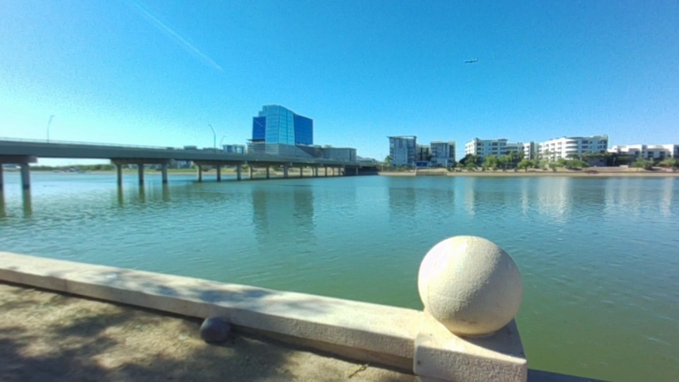

https://github.com/user-attachments/assets/9adf6ec5-45cd-4533-9061-ee4e778a14a1


https://github.com/user-attachments/assets/5f21ac8a-098d-4ccf-8853-52e667b33566


https://github.com/user-attachments/assets/252bd8d6-da3e-4b87-a75b-670cbd67740e


https://github.com/user-attachments/assets/b1ff0342-f1fd-4d08-9dc0-e731f0ab7f68


https://github.com/user-attachments/assets/03b9fe60-a78c-4f78-9025-c796d2229995


https://github.com/user-attachments/assets/7a57d645-c99a-44c8-a1a7-8d0fdfce2626


https://github.com/user-attachments/assets/2b4bc20b-4913-4749-a133-9488898ff56d


https://github.com/user-attachments/assets/f709c2bc-e7fb-4237-8da4-f169f05dda97

# RPI360

**Capture once. Choose your perspective later.**

A dual-fisheye camera system for Raspberry Pi, with a local Web workspace for
360° viewing, reframing, keyframes, and video export. The camera captures the
source. Your phone, tablet, or computer chooses the view.

[繁體中文](README.zh-TW.md) · [Quick start](docs/getting-started/web.md) · [Architecture](docs/architecture.md) · [Validation status](docs/validation/status.md)



**v2 is an alpha implementation.** Core geometry, native/WASM parity, local
browser export, and short Pi recording/preview flows have been exercised.
Sustained hardware performance and Apple device certification remain release
gates. See the [validation report](docs/validation/status.md) for evidence and
limitations; this repository does not claim production certification.

## Try it without a camera

Requires Rust, Node.js 22+, pnpm, and `wasm-bindgen-cli` 0.2.108.

```sh
pnpm install
rustup target add wasm32-unknown-unknown
cargo install wasm-bindgen-cli --version 0.2.108 --locked
pnpm wasm
pnpm dev
```

Open the URL printed by Vite. Three included source-image pairs let you drag
through a scene, adjust horizontal FOV, edit a camera path, and export an MP4.
These built-in examples are explicitly **360 still-frame reframing** demos.
No camera, Python server, cloud account, or media upload is required.

## Capture → transfer → reframe

1. **Capture on the Pi.** One headless service owns both sensors, records real
   sensor timestamps, and stores independent H.264 sources in an R360 bundle.
2. **Transfer to your device.** Paired, authenticated downloads support byte
   ranges, resuming, and checksum verification. Recordings outlive browser tabs.
3. **Make your edit.** Stitch, choose a view, add keyframes, switch aspect ratio,
   and export locally. Editing never changes the source recording.

The live preview contains two unstitched fisheyes packed into one WebRTC video
track. Changing FOV or orientation redraws the current image on the client;
it does not ask the camera to render a new viewpoint.

## Explore the effects

| Camera movement | Projection & format |
| --- | --- |
| Keyframe Reframing · FOV Zoom | Tiny Planet · Inverted Tiny Planet |
| Barrel Roll · Time Remapping | 16:9 · 9:16 · 1:1 · Interactive 360 Viewer |

[Demo gallery, recipes, and reproduction instructions](demos/README.md).
Exported videos contain no labels, debug overlays, or watermarks. Large video
outputs are release artifacts, not source files. The original outdoor material
has irregular motion at approximately 5.6–6 fps; 30 fps virtual camera motion
does not create missing captured detail. Each recipe identifies whether it uses
moving footage or a static source frame.

## Build on the core

| Component | Purpose |
| --- | --- |
| `apps/camera-service` | Picamera2 synchronization, recording, WebRTC, device API |
| `apps/web` | React workspace; viewing, editing, local storage and export |
| `apps/media-worker` | Optional native export jobs using the same renderer |
| `crates/rpi360-core` | Calibration, coordinates, quaternion pose and timeline |
| `crates/rpi360-render` | Shared direct fisheye GPU renderer, native and WASM |
| `packages/web-sdk` | Device, media, rendering and project APIs |
| `packages/python` | Calibration tools, client, native core bridge and v1 transition API |
| `packages/apple-sdk` | C ABI/XCFramework, Swift client and AVFoundation adapter |

See [core boundaries](docs/architecture/core.md), [recording format](docs/protocols/recording.md),
[device OpenAPI](schemas/device-api.openapi.yaml), and [migration](docs/migration/v2.md).

## Hardware and limits

The development rig is a Raspberry Pi 5 with two IMX219 fisheye cameras. The
balanced candidate mode preserves the full field of view at 1640×1232 per lens.
Software synchronization improves sensor frame timing; it is not a global
shutter or a guarantee of simultaneous exposure for every pixel.

Lens calibration is specific to the physical rig. Close subjects can show
parallax at the seam. This version does not include AI tracking, IMU
stabilization, optical-flow interpolation, cloud processing, or an App Store app.

[Camera setup](docs/getting-started/camera.md) · [Calibration](docs/calibration.md) ·
[Hardware & enclosure](hardware/README.md) · [Development](CONTRIBUTING.md)

Source code: [MIT](LICENSE). Curated media: [CC BY 4.0](LICENSE-MEDIA).
Enclosure CAD: [CERN-OHL-P-2.0](hardware/cad/LICENSE).
