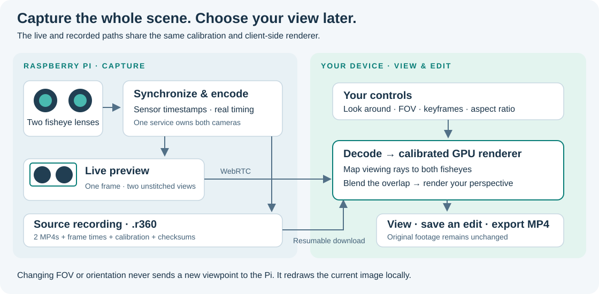
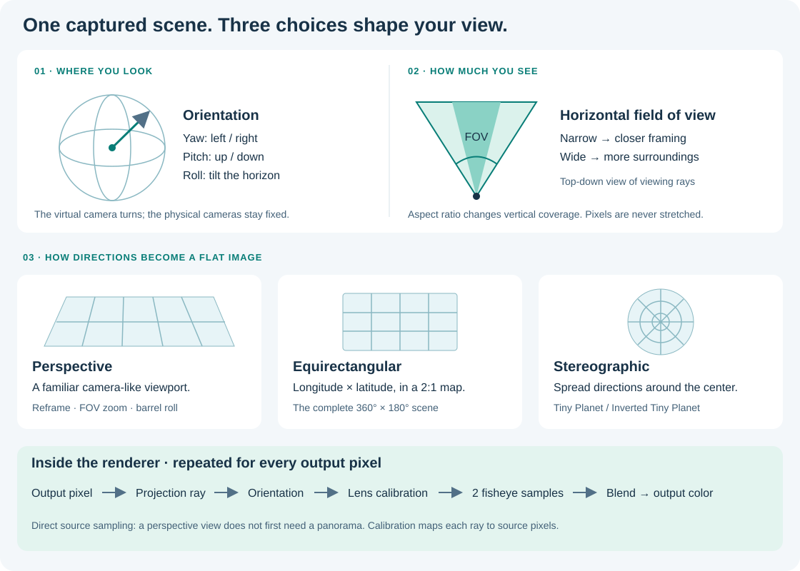

# RPI360

**Capture once. Choose your perspective later.**

A dual-fisheye camera system for Raspberry Pi. Capture the whole scene on the
camera, then preview, reframe, edit and export on your own device.

[Try the workspace](#try-it-without-a-camera) · [Connect your Pi](#connect-your-pi-for-live-preview) · [Simple API](#simple-api) · [How it works](#how-it-works)

**Keyframe Reframing** — smooth virtual camera movement over the original footage.

https://github.com/user-attachments/assets/f709c2bc-e7fb-4237-8da4-f169f05dda97

**v2 alpha.** Local browser export and short Pi recording/preview flows have been
validated. Sustained hardware performance and Apple device certification remain
release gates. See the [validation report](docs/validation/status.md).

## How it works



1. **The Pi captures.** One service synchronizes both cameras, records each
   source with its real timestamps, and provides a low-latency preview.
2. **Your device renders.** A single preview frame contains both unstitched
   fisheyes. Your browser decodes it and uses the calibration to construct a view.
3. **Your edit stays separate.** FOV, orientation, keyframes and speed changes
   live in a project. Download a recording and continue editing offline.

Live preview and recorded playback use the same geometry. There is no camera-side
VR rendering, and changing the view does not renegotiate the stream.

## From fisheye to your view



**Orientation** chooses where you look. **Horizontal FOV** chooses how wide you
see. **Projection** chooses how directions map to a flat image:

| Projection | Use it for | What changes |
| --- | --- | --- |
| Perspective | Familiar framing, zooms, pans, barrel rolls | A window onto the scene |
| Equirectangular | Full 360° playback and 360 MP4 export | Longitude × latitude in a 2:1 image |
| Stereographic | Tiny Planet and Inverted Tiny Planet | A wide circular view; orientation selects ground or sky |

For each output pixel, the GPU builds a viewing ray, applies orientation, maps
that direction through both calibrated lenses, and blends their overlap. A
perspective view samples the fisheyes directly; a panorama is only produced when
you request one. Changing aspect ratio changes coverage without stretching the
image. [Coordinate system and projection details](docs/architecture/core.md).

## Demo videos

All videos below are playable directly on GitHub. Titles and explanations stay
outside the image: no labels, watermarks or debug overlays are burned in.

The original outdoor footage has irregular motion at approximately **5.6–6 fps**.
The exports update at 30 fps; this smooths virtual camera motion but cannot invent
missing captured detail. The still-frame demonstrations are identified below.

### Tiny Planet

A wide stereographic view looking toward the ground. **360 still-frame reframing.**

https://github.com/user-attachments/assets/2b4bc20b-4913-4749-a133-9488898ff56d

### Inverted Tiny Planet

The opposite viewing direction turns the scene inward. **360 still-frame reframing.**

https://github.com/user-attachments/assets/7a57d645-c99a-44c8-a1a7-8d0fdfce2626

### Barrel Roll

One complete roll with a deliberate start and finish. **360 still-frame reframing.**

https://github.com/user-attachments/assets/03b9fe60-a78c-4f78-9025-c796d2229995

### FOV Zoom

Move smoothly between narrow and wide framing. **360 still-frame reframing.**

https://github.com/user-attachments/assets/b1ff0342-f1fd-4d08-9dc0-e731f0ab7f68

### Time Remapping

A speed curve applied to moving source footage, preserving its original timing.

https://github.com/user-attachments/assets/252bd8d6-da3e-4b87-a75b-670cbd67740e

<details>
<summary><strong>Multi-aspect Reframing · portrait and square videos</strong></summary>

The same source, framed individually for 9:16 and 1:1. **360 still-frame reframing.**

https://github.com/user-attachments/assets/5f21ac8a-098d-4ccf-8853-52e667b33566

https://github.com/user-attachments/assets/9adf6ec5-45cd-4533-9061-ee4e778a14a1

</details>

[Recipes and reproduction](demos/README.md) · [Video URLs and checksums](demos/videos.manifest.json).
The videos use the same renderer as user exports. Video binaries are hosted as
GitHub attachments; source control contains recipes, manifests and posters.

## Try it without a camera

Requires Rust, Node.js 22+, pnpm, and `wasm-bindgen-cli` 0.2.108.
Run these commands from a checkout of this v2 branch:

```sh
pnpm install
rustup target add wasm32-unknown-unknown
cargo install wasm-bindgen-cli --version 0.2.108 --locked
pnpm wasm
pnpm dev
```

Open **http://localhost:5173**. Choose an included scene, drag to look around,
scroll to change FOV, add keyframes, then **Export video**. The included scenes
are 360 still-frame samples; import a recording to edit moving footage.
No camera, Python server or cloud account is needed.

## Connect your Pi for live preview

Keep your computer and Pi on the **same local network**. Set up the
[Pi camera service and your rig's calibration](docs/getting-started/camera.md#1-on-the-pi-install-and-start-the-camera-service)
first. Leave that service running; it prints the first-time pairing code.

**On your computer, in terminal 1:**

```sh
make connect CAMERA=YOUR_USER@raspberrypi.local
```

This opens the SSH tunnel for control and file transfer. Enter your normal SSH
password if requested, and keep the terminal open. Video travels directly over
LAN WebRTC; SSH forwards the API, not the video packets.

**On your computer, in terminal 2:**

```sh
pnpm dev
```

**In your browser:**

1. Open **http://localhost:5173** → **Connect camera**.
2. Keep **Device address** as `/api`. Enter the six-digit code printed on the
   Pi. Leave the code empty when reconnecting an already-paired tab.
3. Choose **Camera → Open live preview**. Wait for **LIVE · Synced**, then drag
   the image or adjust **Field of view**, **Yaw**, **Pitch** and **Roll**.

Use **Start recording** / **Stop recording** to capture on the Pi. Closing a
preview does not stop a recording. Download the finished recording from the
Camera panel to edit and export locally.

If connection fails, run `curl --fail http://127.0.0.1:8765/v1/info` in another
terminal. A failed request means the tunnel or Pi service is unavailable.
[Setup, reconnecting, pairing recovery and troubleshooting](docs/getting-started/camera.md).

## Simple API

The SDKs are workspace packages in this alpha. Use them from this checkout.

**A live VR canvas in TypeScript:**

```ts
import { DeviceClient, LiveViewer } from "@rpi360/web-sdk";

const camera = new DeviceClient("/api", savedToken);
// First time only: await camera.pair(codeFromPi);
const viewer = await LiveViewer.connect(canvas, camera);
viewer.setView({ yaw: 45, pitch: -10, fov: 100 });
// When done: await viewer.close();
```

`canvas` is an HTML canvas; `savedToken` is the token returned by pairing (empty
before first pairing). `setView()` redraws locally. Try the
[runnable example](apps/web/api-example.html) at
**http://localhost:5173/api-example.html**, in the same tab after closing the
workspace preview.

**Capture from Python:**

```python
from getpass import getpass
from rpi360.client import DeviceClient

camera = DeviceClient("http://127.0.0.1:8765")
camera.pair(getpass("Pairing code from the Pi: "))
camera.start_capture()
camera.wait_for_sync()
camera.start_recording()
# ... capture your clip ...
recording = camera.stop_recording()
```

Install locally with `uv sync`, then run with `uv run python`. One controller is
supported: use Python instead of pairing the browser, or reuse your authorized
token. [API guide and complete examples](docs/getting-started/api.md) ·
[OpenAPI](schemas/device-api.openapi.yaml) · [Swift SDK](packages/apple-sdk/README.md).

## Repository map

| Component | Responsibility |
| --- | --- |
| `apps/camera-service` | Picamera2 sync, reliable source recording, preview and device API |
| `apps/web` | Local viewing, media library, editing and export |
| `apps/media-worker` | Optional native export jobs |
| `crates/rpi360-core` | Calibration, coordinates, quaternion pose and timeline |
| `crates/rpi360-render` | Shared native/WASM GPU renderer |
| `packages/web-sdk` | Device, live viewer, media and export APIs |
| `packages/python` | Calibration, device client, native bridge and v1 compatibility |
| `packages/apple-sdk` | C ABI/XCFramework, Swift client and AVFoundation adapter |

[Full repository map](docs/development/repository.md) · [Architecture](docs/architecture.md) ·
[Recording format](docs/protocols/recording.md) · [Migration](docs/migration/v2.md) ·
[Development](CONTRIBUTING.md).

## Hardware and support

The development rig is a Raspberry Pi 5 with two IMX219 fisheye cameras.
The balanced candidate mode preserves the full sensor view at 1640×1232 per
lens. The paired preview is 1440×540 H.264. These are requested settings, not
sustained-performance promises.

Lens calibration belongs to the physical rig. Software synchronization improves
sensor frame timing; it does not turn rolling-shutter sensors into global-shutter
cameras. Nearby subjects can show parallax at the seam. AI tracking, IMU
stabilization, generated slow motion and an App Store app are outside this alpha.

[Hardware & enclosure](hardware/README.md) · [Calibration](docs/calibration.md) ·
[Measured validation and limits](docs/validation/status.md).

Source code: [MIT](LICENSE). Curated media: [CC BY 4.0](LICENSE-MEDIA).
Enclosure CAD: [CERN-OHL-P-2.0](hardware/cad/LICENSE).
