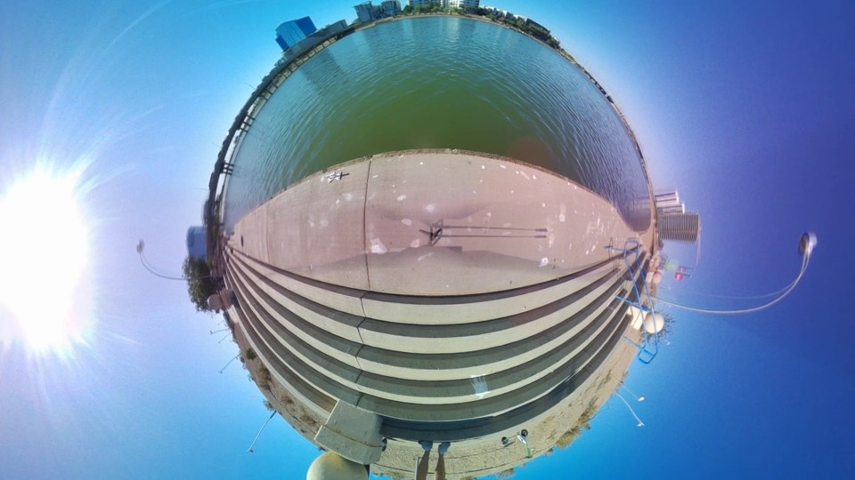
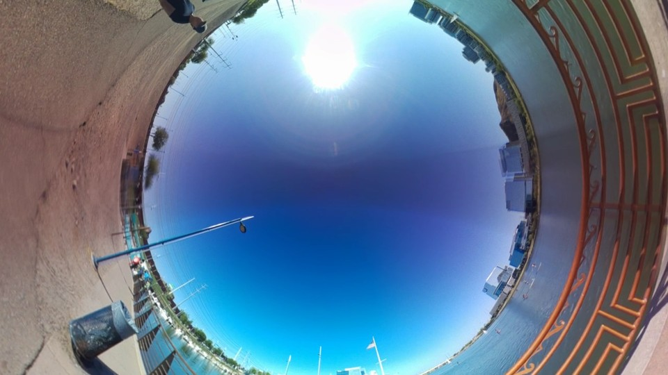
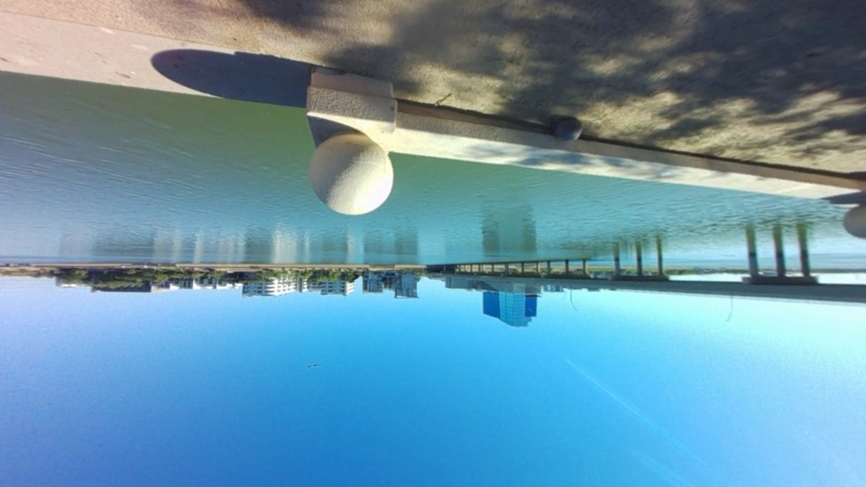
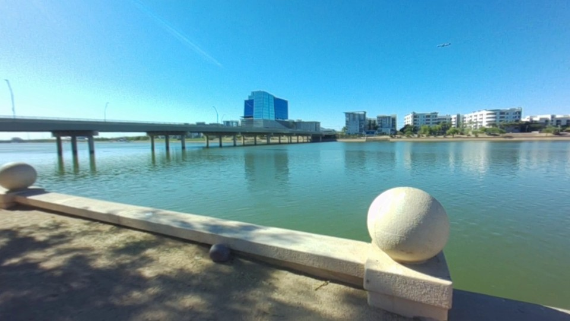
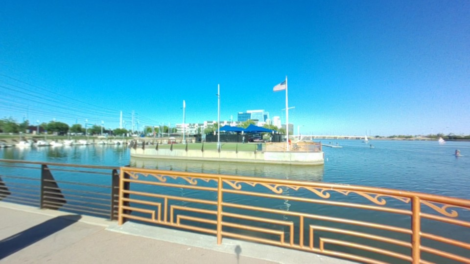
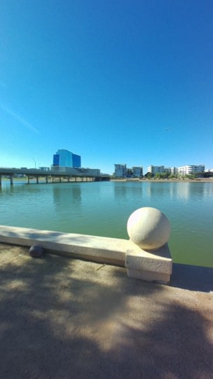
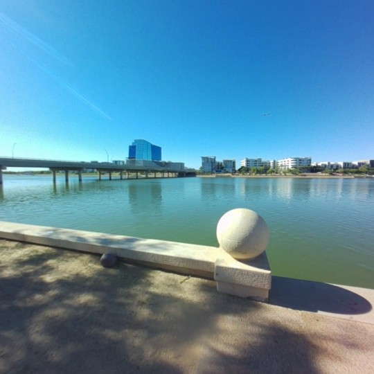

# Demo gallery

These examples use the existing outdoor camera recordings. No new filming,
watermarks, burned-in labels, or motion interpolation is involved. Every render
uses the same Rust GPU engine exposed to applications.

| Demo | Preview | Source treatment |
| --- | --- | --- |
| Keyframe Reframing |  | Original variable-rate footage |
| Tiny Planet |  | 360 still-frame reframing |
| Inverted Tiny Planet |  | 360 still-frame reframing |
| Barrel Roll |  | 360 still-frame reframing |
| FOV Zoom |  | 360 still-frame reframing |
| Time Remapping |  | Original variable-rate footage |
| Portrait reframing |  | Independent 9:16 composition |
| Square reframing |  | Independent 1:1 composition |

Run the Web workspace for the **Interactive 360 Viewer**, source/panorama/view
switching, keyframes and local export. Its three built-in sources are labeled
static-image examples. Tiny Planet and Inverted Tiny Planet use stereographic
projection. FOV Zoom changes viewing angle; it is not a physical dolly zoom.

## Reproduce

Obtain the original source files whose hashes appear in `sources.manifest.json`.
Keep their session folders under one local directory, then run:

```sh
make core
uv run --all-packages python tools/demos/build.py --source-root /path/to/originals
```

Recipes contain source identifiers, calibration, timing, pose tracks and output
settings. Outputs and verification reports go to ignored `demos/outputs/`.
Rendered MP4s are intended for a versioned release asset archive; no stable v2
media release is implied by the presence of a local output. Git keeps posters,
recipes and checksums, not another set of large videos.

The originals average approximately 5.6–6 fps and contain irregular gaps.
30 fps output describes smooth virtual camera motion, not 30 fps captured detail.
The source cameras' original clock offset is unknown; recipes do not invent
synchronization metadata. Near subjects may show parallax at the seam. Inspect
both motion and seams before selecting a clip for publication.

## Review local renders

Run `python tools/demos/serve.py` and open `http://localhost:5174` to play the
rendered gallery. `python tools/release/bundle.py` packages the verified outputs
and recipes into `dist/rpi360-2.0.0-alpha.1-demos.zip`, with SHA-256 checksums in
`dist/artifacts.manifest.json`. Packaging does not publish a stable release.
