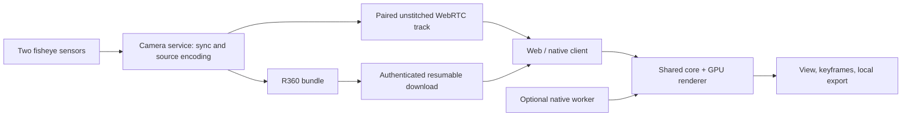

# Architecture

The camera process owns hardware, recording state and storage. Client connections
own preview sessions, not recordings. The client owns projection, FOV, orientation,
keyframes and exports. No capture path imports OpenCV or the renderer.

`rpi360-core` has no codecs, network or UI. `rpi360-render` uses its types and a
single WGSL shader to sample the source lenses directly into a viewport.
Media adapters own demux/decode/encode and real PTS; they do not interpolate pose.
The device SDK owns connection, commands and transport; it has no geometry.

Python's legacy API remains a migration surface. New applications should use the
versioned schemas and SDKs rather than depend on `Player` or OpenCV windows.

- [Core coordinates and boundaries](architecture/core.md)
- [Recording and recovery](protocols/recording.md)
- [Device protocol](protocols/device.md)
- [Architecture decisions](adr/0001-v2-boundaries.md)
