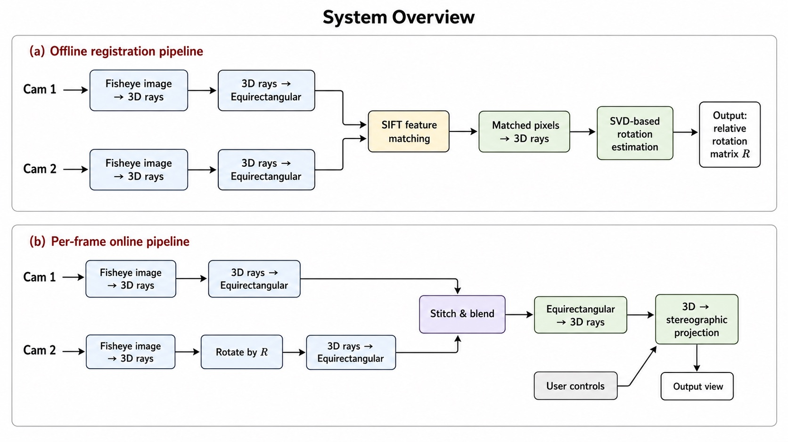
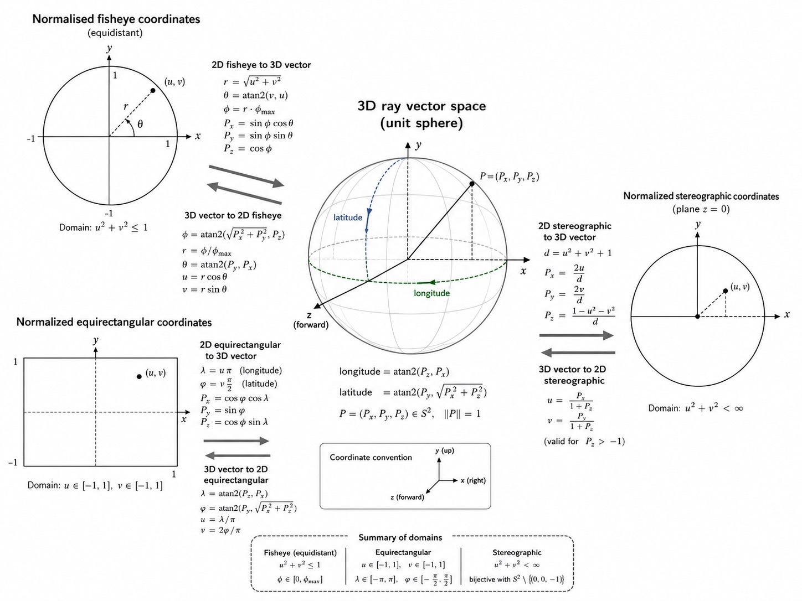

# Architecture

Stage-one checkerboard calibration estimates K/D independently for both cameras.
Stage-two rig calibration maps both cameras onto the unit sphere, matches SIFT
features in the overlapping equirectangular regions, rejects outliers with
spherical RANSAC, and refines `R_cam1_to_cam0` with Kabsch/SVD.

`Player.live()` reads calibration from the JSON file. `Player.mp4()` ignores
external JSON and uses the complete calibration result embedded in the MP4.
Both sources produce the same immutable `FrameBundle` and `PlayerFrame`
contracts.

## Ownership and threading

The core is pull-based and single-consumer. A returned frame is an independent,
read-only BGR snapshot and can be sent to another thread, queue, web handler, or
platform adapter. Live capture keeps only the latest complete camera pair, so a
slow preview does not build an unbounded queue.

The OpenCV adapter owns only window creation, key mapping, overlays, and refresh
timing. It issues commands to `Player`; it does not decode, stitch, or own camera
lifecycles. Another desktop toolkit or service can replace that adapter without
changing the media and geometry layers.

RPi recording owns a separate dual-encoder lifecycle. Preview rendering can be
slower than the cameras without reducing or re-encoding the original H.264
tracks. Stopping a recording closes both encoders, muxes track IDs 1 and 2,
embeds both metadata JSON documents, verifies the result, and atomically
publishes the final MP4.

## Per-frame computation

Stitching is lazy. Changing yaw, pitch, roll, FOV, or projection renders another
view from the cached blended panorama instead of remapping both fisheye images
again.

The renderer preserves the proven Mapper row-vector convention. Do not insert
RGB/BGR conversion inside the core: every public NumPy image is OpenCV-compatible
`uint8` BGR.
