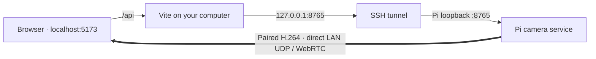

# Connect a Raspberry Pi for live VR preview

You need the Pi **and** the viewing computer on the same LAN. This guide uses
SSH for the device API and a local browser workspace. No public port forwarding
or cloud service is needed. Start with Chrome on the development computer.



The tunnel carries control, SDP negotiation and file downloads. **WebRTC media
uses a separate direct LAN connection.** A working SSH tunnel alone does not
make remote video work across unrelated networks or restrictive guest Wi-Fi.

## 1. On the Pi: install and start the camera service

Use a checkout of the same v2 branch as your computer. Raspberry Pi OS must
identify both cameras; the Picamera2/libcamera build must provide `SyncMode`,
`SyncReady` and `SensorTimestamp`. The inspected rig uses Picamera2 0.3.37 and
libcamera 0.7.2. Use OS packages for camera integration.

From the repository root **on the Pi**:

```sh
sudo apt install python3-venv python3-picamera2 python3-av ffmpeg
bash deploy/raspberry-pi/install.sh v2.0.0-alpha.1-local
```

This installs a new version in `~/.local/share/rpi360/releases/`. It does not
activate it or alter an existing prototype. Use a new identifier for subsequent
installs; the installer will not overwrite a release.

Copy **your rig's calibration** to the separate data directory:

```sh
# Replace this source path with your actual calibration file.
cp /path/to/your/calibration.json ~/.local/share/rpi360/data/calibration.json
```

Keep the original calibration and recordings backed up. The repository's example
calibration is for one physical rig; it is not a universal preset.

Start the service and **leave this Pi terminal running**:

```sh
~/.local/share/rpi360/releases/v2.0.0-alpha.1-local/.venv/bin/rpi360-camera \
  --data-dir ~/.local/share/rpi360/data \
  --calibration ~/.local/share/rpi360/data/calibration.json \
  --origin http://localhost:5173
```

If no controller is paired, it prints `Local pairing code (valid 5 minutes): …`.
Keep the code private. A service with an existing controller does not print a
new code; reconnect using the saved pairing in that browser or tab.

## 2. On your computer: open the tunnel and workspace

After the [Web build setup](../../README.md#try-it-without-a-camera), open two
terminals in the local repository.

**Terminal 1 — SSH tunnel:**

```sh
make connect CAMERA=YOUR_USER@raspberrypi.local
```

Replace the SSH destination with the same one you normally use to reach the Pi.
A hostname such as `raspberrypi`, its `.local` name, or a LAN IP can be used.
Enter your SSH password when prompted. Successful tunneling stays running
without returning a shell prompt. Keep this terminal open.

If an RPI360 API is already reachable on local port 8765, `make connect` reports
that the existing connection is available and exits successfully without asking
for a password or opening another tunnel. Keep the original tunnel running and
use the workspace. This does not verify or switch its SSH destination; close
the old tunnel first when intentionally connecting to another camera.

**Terminal 2 — workspace:**

```sh
pnpm dev
```

Open **http://localhost:5173**. Vite uses a fixed port and reports a conflict
rather than silently changing to an origin the Pi does not allow.

## 3. In the browser: connect and preview

1. Select **Connect camera** in the header or Camera panel.
2. Keep **Device address** as **`/api`**. This is the local workspace proxy,
   not a place to enter an SSH hostname or password.
3. For first pairing, enter the **six-digit Pi service code**. Select
   **Remember this browser** on your own computer to reconnect from new tabs or
   after restarting the browser. Leave the code empty only if pairing has already
   been saved in this browser or tab. Press **Connect camera**.
4. Select **Camera** in the left rail → **Open live preview**.
5. Wait for **LIVE · Synced**. Drag to look around, scroll to zoom, or change
   **Field of view**, **Yaw**, **Pitch** and **Roll**.

The Pi sends two complete fisheye views side by side. Projection and viewpoint
changes happen on your computer. Use **Source** to inspect the incoming pair,
**Panorama** for the whole scene, and **Reframe** for an interactive viewport.

Use **Start recording** after sync lock, then **Stop recording** to finalize.
Closing preview or the browser does not stop recording. Reconnect to stop it and
download the finished bundle from the Camera panel. The source stays on the Pi.

## Diagnose the connection

In another local terminal:

```sh
curl --fail http://127.0.0.1:8765/v1/info
curl --fail http://localhost:5173/api/v1/info
```

The first checks the SSH path to the Pi service; the second also checks Vite's
proxy. Both should return JSON with `name: RPI360` and a `paired` state.

| What you see | What to do |
| --- | --- |
| Cannot reach the Pi / empty HTTP 500 | Check both commands above. Start the Pi service and keep the SSH tunnel open. |
| API already available on 8765 | The helper found an existing connection. Reuse it and go to the browser; no new SSH login is needed. |
| Port 8765 occupied but API unavailable | The listener may be a stale tunnel or another program. Check it with `lsof -nP -iTCP:8765 -sTCP:LISTEN`, then check the Pi service. The helper leaves the existing process untouched. |
| Port 5173 already in use | Reuse the running workspace at `http://localhost:5173`; do not start a second copy. |
| Pairing code invalid or expired | If never paired, restart the service and use the new five-minute code. A saved token needs no new code. |
| Camera online but no pairing saved / `401` | SSH and pairing are separate. In the already-paired tab, select **Remember this browser** and connect again; the new tab can then reconnect without a code. If that tab is lost, use pairing recovery below. |
| `409` / controller already paired | Only one controller is supported. Revoke it in the connected tab before pairing another. |
| `409` / preview already active | Close the other preview first. Only one viewer is supported. |
| Connected but no video | Check both devices are on the same LAN, UDP is permitted, and guest/client isolation is disabled on that network. The SSH tunnel does not carry media. |
| Origin is not allowed | Use exactly `http://localhost:5173`; alternatively explicitly configure your chosen trusted origin on the Pi. |
| Calibration is missing | Start the service with `--calibration` pointing to your valid rig profile. Recording can work without VR calibration; VR preview cannot. |

### Reconnect and recover pairing

**Remember this browser** saves the controller token in local storage for this
browser profile and origin. Other tabs at `http://localhost:5173` can then connect
without a new code; restarting the browser also preserves it. An incognito
window, another browser, `http://127.0.0.1:5173`, or clearing site data does not
share that pairing. Leave this option unchecked on shared computers.

Without this option, pairing lasts only in the current tab's session storage.
Old v2 tabs can migrate their existing token by selecting **Remember this browser**
and **Connect camera**; no Pi restart or new controller is required. SSH being
connected, or `/v1/info` reporting `paired: true`, does not mean the current tab
has the controller token.

In a connected tab, **Connect camera → Revoke this controller** invalidates the
server token and removes both local and session copies in that tab. Restart the
Pi service for a new code. Revocation invalidates other tabs' copies as well;
they discard rejected saved credentials on the next connection attempt.

If the only controller token has been lost, stop the camera service first, then
rename `authorized-clients.json` in **the data directory you actually use** to
`authorized-clients.json.backup-TIMESTAMP`. Restart the same service. This revokes
old tokens and prints a fresh code. It does not remove recordings or calibration.
Do not reset pairing during an active recording.

## Trusted HTTPS deployment

The SSH workflow is for development on the local computer. An iPhone/iPad cannot
reach that computer's loopback address. For direct device access, deploy the
workbench on a trusted HTTPS origin (for example on the Pi) instead.

Pass `--host 0.0.0.0 --cert CERT --key KEY` to the Pi service. Certificates must
be trusted by each client and name the camera hostname. A reverse proxy may serve
the built Web app and proxy the API, yielding one HTTPS origin. Preserve bearer,
Range and SDP data. WebRTC still needs negotiated LAN UDP connectivity.

For a development CA, issue a certificate whose SAN includes the Pi hostname,
install the CA explicitly using each device's OS settings, and verify HTTPS
without interstitials before pairing. Do not disable certificate validation.
Chrome may also require local-network permission in the actual deployment.

Build `pnpm wasm && pnpm build`, copy `apps/web/dist` into the release directory,
and pass `--web-root /path/to/release/web`. The built workbench calls `/v1` on its
own origin. Apple device/browser behavior still needs device-specific validation.

## Service lifetime, versioning and camera mode

For unattended operation, adapt the supplied systemd user unit. It uses the
versioned `current` path and separate data storage; switch `current` only after
validating the new release. Retain the previous release to roll back executable
code without touching recordings, tokens or calibration.

The candidate source mode is 1640×1232, 30 fps, 8 Mbps per camera, retaining the
full sensor view. Preview starts with two 720×540 images in one 1440×540 H.264
track. These are requested settings, not a sustained-performance promise.
`GET /v1/settings` and revision-checked `PUT /v1/settings` control exposure and
white balance. See [API examples](api.md) and [validation](../validation/status.md).
