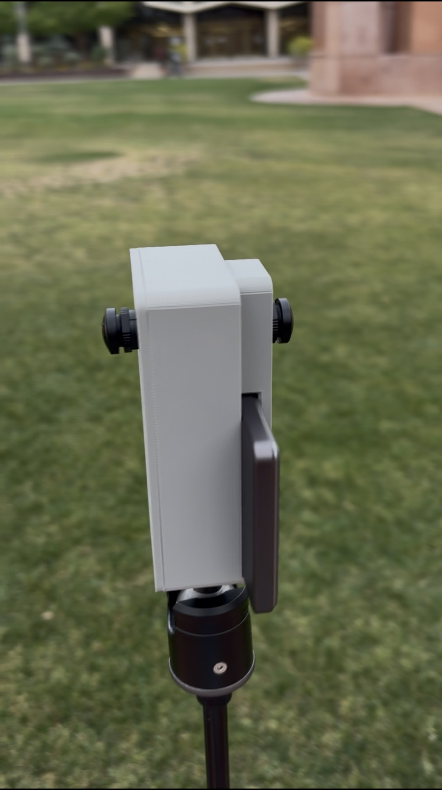
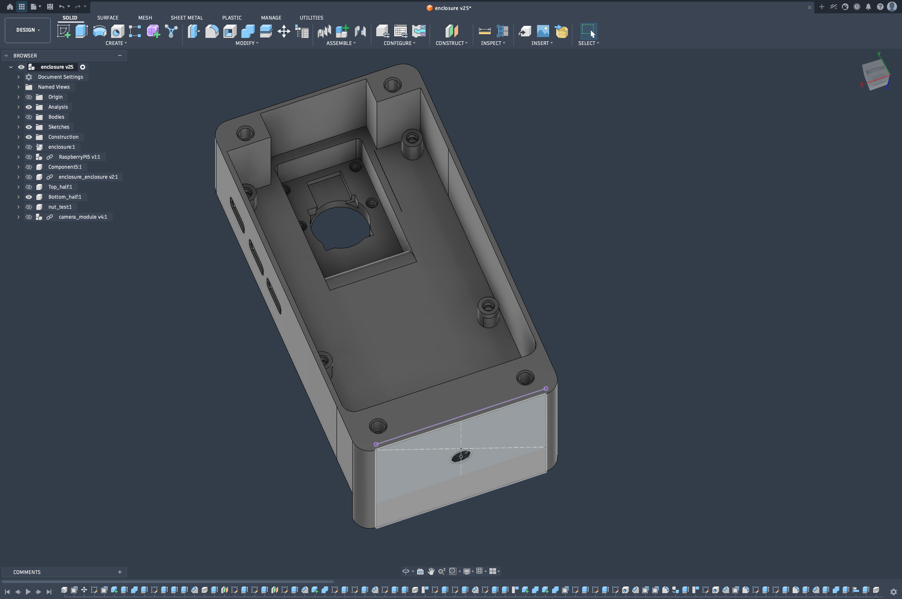
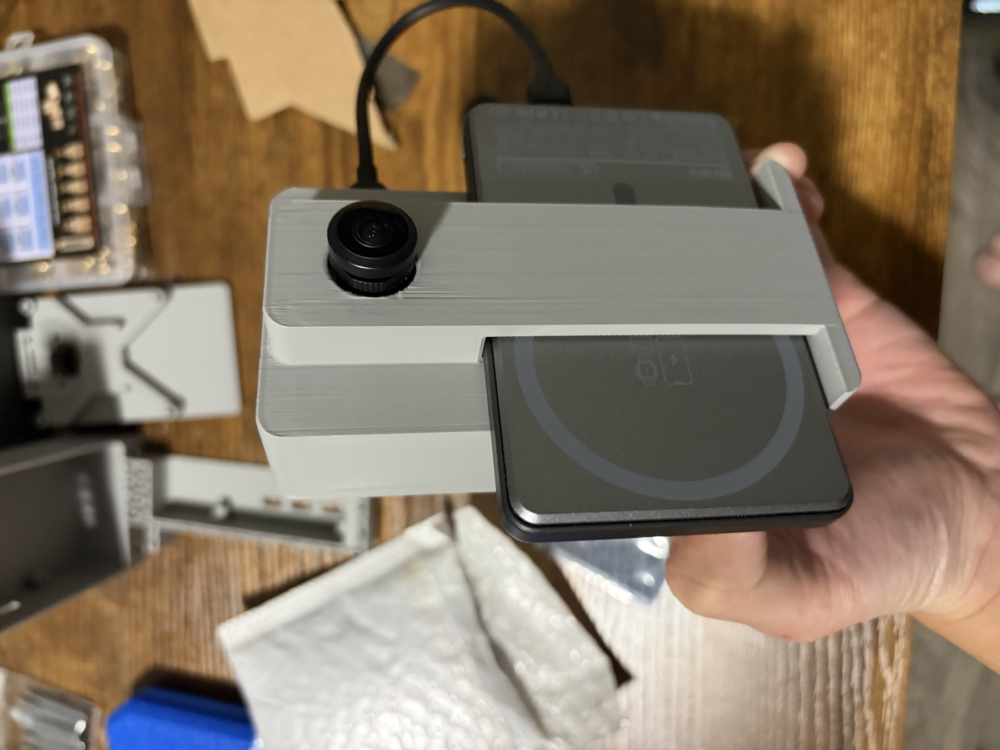
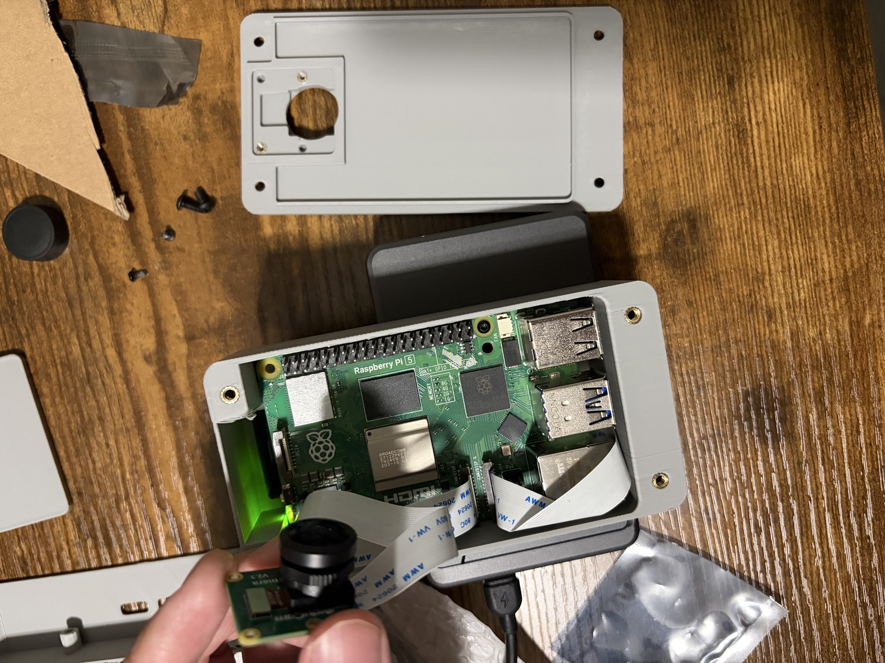
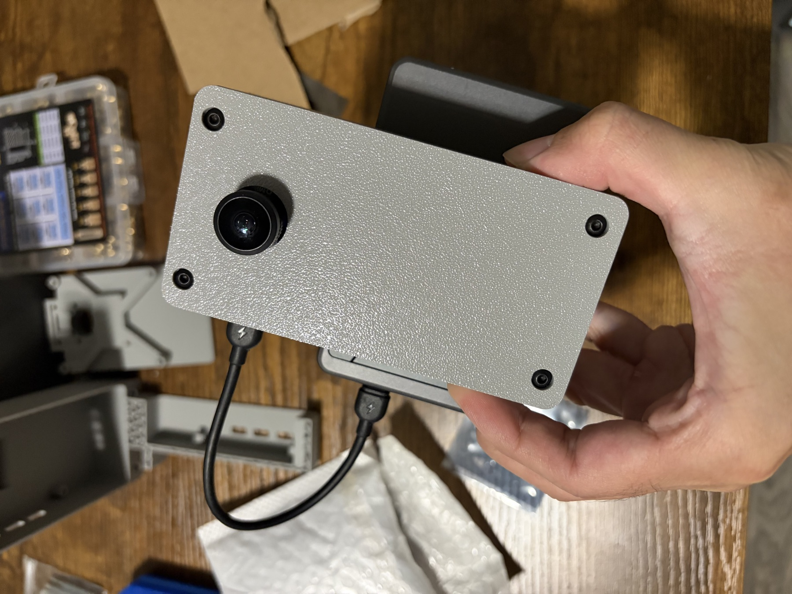
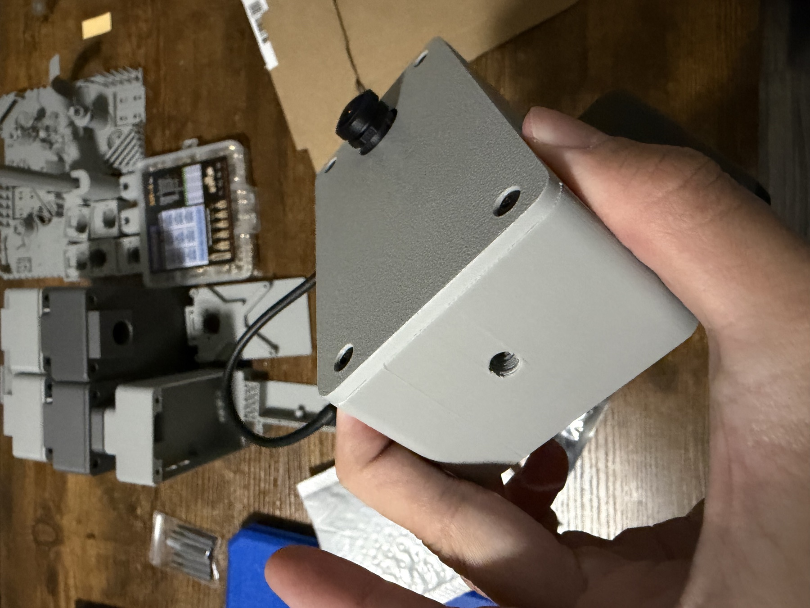
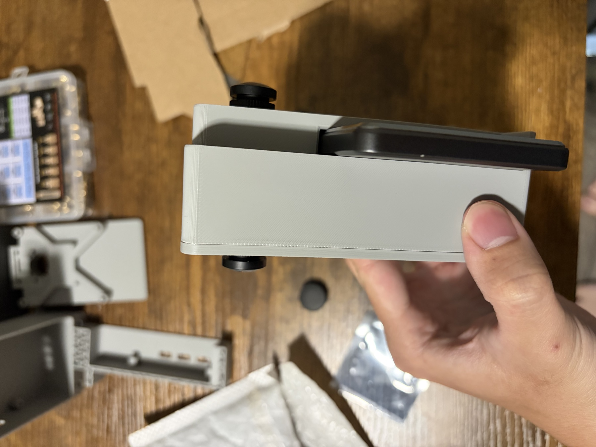

# Dual-fisheye camera hardware



This is the physical enclosure used to validate RPI360 on a Raspberry Pi 5.
The lenses are held back-to-back, the Pi and both camera cables are contained
inside the printed body, and an external slot holds one specific phone power
bank.

The documented unit does not use an active-cooling assembly.

## Bill of materials

| Item | Validated specification | Purpose |
| --- | --- | --- |
| Computer | Raspberry Pi 5, 8 GB | Camera control, calibration, and recording |
| Cameras | 2 x [Arducam B0287 Sony IMX219 wide-angle modules](https://www.arducam.com/arducam-imx219-wide-angle-camera-module-for-nvidia-jetson-raspberry-pi-compute-module-4-3-3-b0287.html) | Back-to-back fisheye capture |
| Printed enclosure | [`top-half.stl`](cad/top-half.stl) and [`bottom-half.stl`](cad/bottom-half.stl) | Rigid optical and electronics mount |
| Camera inserts | M2 heat-set inserts, 2 mm long | Captive threads for camera PCB mounting |
| Camera screws | M2 x 4 mm | Fasten camera PCBs to the printed mounts |
| Enclosure inserts | M3 heat-set inserts, 3 mm long | Captive threads for the main enclosure |
| Enclosure screws | M3 x 6 mm | Join the printed enclosure parts |
| Storage | High-quality microSD card | OS and two simultaneous video streams |
| Field power | Henry Chi's existing phone power bank | Fits the model-specific external slot |
| Bench power | Reliable 5 V / 5 A supply | Setup, calibration, and development |
| Support | Compatible tripod and adapter | Keep the rig stationary during calibration |

Use one insert and screw for every corresponding mounting pocket used by the
printed revision, and keep spares. Do not substitute a longer screw without
checking the available depth: it can bottom out in an insert, stress the print,
or contact a camera PCB.

## CAD and dimensions



The two printable models are now included:

- [`cad/top-half.stl`](cad/top-half.stl): approximately
  60.0 x 113.8 x 5.0 mm;
- [`cad/bottom-half.stl`](cad/bottom-half.stl): approximately
  60.0 x 113.8 x 41.0 mm.

STL is unitless. Import both models as **millimetres** and verify those bounding
dimensions before slicing. See the [CAD notes](cad/README.md).

The power-bank opening was measured around Henry Chi's existing unit. It is not
a universal mount: a power bank with different dimensions will not fit without
editing the CAD.

| Dedicated power-bank fit | Open enclosure and cable routing |
| --- | --- |
|  |  |

## Heat-set inserts and screws

The inserts replace loose nuts inside the enclosure:

- **Camera mounts:** M2 thread, 2 mm-long heat-set insert, used with an
  M2 x 4 mm screw.
- **Main enclosure:** M3 thread, 3 mm-long heat-set insert, used with an
  M3 x 6 mm screw.

M2/M3 identifies the internal thread, not the insert's outer diameter or knurl.
Those external dimensions vary between suppliers. Measure the actual inserts,
compare them with the STL pockets, and make a small test print first.

Install inserts before electronics:

1. Print and clean the insert pockets without enlarging them by force.
2. Place the correct insert squarely over its matching pocket.
3. Heat it with an insert tip on a temperature-controlled soldering iron.
4. Press straight down only until the insert is flush with the designed
   surface; do not push it through the boss.
5. Remove the iron and let the plastic cool completely before testing a screw.
6. Verify alignment using the specified screw by hand, without the camera or Pi
   installed.

Do not heat-set an insert with a camera PCB, ribbon cable, power bank, or
Raspberry Pi inside the enclosure.

## Assembly sequence

1. Print both STL files in the same units and confirm that their mating edges
   align without force.
2. Install the M2 x 2 mm and M3 x 3 mm heat-set inserts in their respective
   pockets.
3. Attach each camera PCB with M2 x 4 mm screws. Tighten only enough to prevent
   movement; PCB flatness and lens orientation matter more than torque.
4. Place the Raspberry Pi 5 in the bottom half and connect the two camera
   ribbon cables. Keep every cable clear of the case seam and screw paths.
5. Confirm that logical camera 0 and camera 1 remain connected to their intended
   physical lenses.
6. Fit the top half and close the enclosure using M3 x 6 mm screws in an even,
   alternating pattern.
7. Slide only the specifically fitted power bank into its external opening and
   connect the short power cable without loading the camera frame.
8. Mount the completed unit to the compatible tripod.
9. Run both calibration stages after final assembly and tightening.

| Camera face and enclosure screws | Enclosure mounting interface |
| --- | --- |
|  |  |



## Rig geometry

The lenses must be mounted back-to-back with their optical axes approximately
180 degrees apart. Keep the lens centers as close together as the camera boards
and enclosure allow.

Exact alignment is not required because rig calibration measures the remaining
rotation. Mechanical stability is required. Re-run both calibration stages
after changing a camera, lens focus, camera board, screw tension, ribbon-cable
routing, or either printed part.

Keep the case, Pi, cables, and fitted power bank outside as much of each
circular image as possible. A small unavoidable footprint can be placed near
the nadir, but large obstructions reduce overlap and SIFT matches.

## Camera identity

Logical camera 0 and camera 1 must stay connected to the same physical lenses.
Before calibration:

```bash
rpicam-hello --list-cameras
```

If the camera order changes, restore the connections or recalibrate. RPI360
records the logical camera mapping as MP4 track IDs 1 and 2.

## Printable calibration board

Print [`checkerboard-9x6-a4.pdf`](calibration/checkerboard-9x6-a4.pdf) at
**100% / Actual Size** in A4 landscape mode with page fitting disabled. The
OpenCV-style pure grid has 9 x 6 inner corners and 25 mm squares. Confirm that
four adjacent squares measure exactly 100 mm.

Mount it to a flat surface. A warped sheet produces biased intrinsics.
